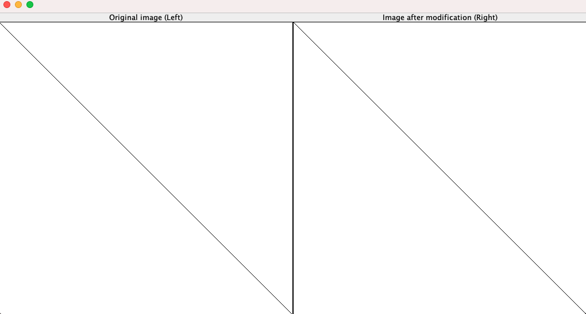

## Homework 0: Render an Image on the Screen

The purpose of this homework is to render an image on the screen and set up the environment for 
future assignments. Here, a sample program is developed to display and manipulate two images in 
left and right panes. The program creates a plain white RGB image (resolution: 512 x 512) 
with black line drawn on it. The program where the parameter "n" that is a "dummy" parameter
used to give an additional example of command line args in Java.

### To run the code from command line, first compile with:

> javac ImageDisplay.java

### and then, you can run it with the following command:

> java ImageDisplay n

### Demo Run Example

#### C++ [Starter Code](ImageDisplay_C++) Project in MS Visual Studio is provided by Professor [Parag Havaldar](https://viterbi.usc.edu/directory/faculty/Havaldar/Parag)