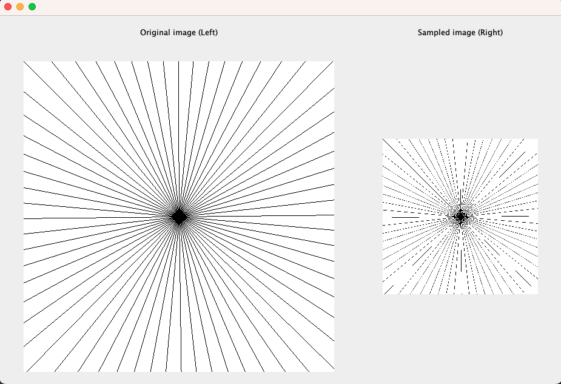

## Homework 1: Aliasing and Resampling ##

The purpose of this homework assignment is to understand Sampling and Filtering of signals
spatially and temporally. The homework is divided into two parts covering Sampling and
Aliasing in [1. Spatial](#part-1-spatial-resampling-and-aliasing) and 2. Temporal domains.

Refer to the [homework specs.](Assignment%201%20-%20Description.pdf) for exact details of the assignment.

### Part 1. Spatial Resampling and Aliasing

Here two images are generated and displayed side by side. The first image is the original
generated image of size 512x512 and the second one is a resampled version of the image scaled
by a factor of ```s```. The task is to observe the scaled image with and without anti-aliasing.

The program takes in the following parameters:
```
n - Number of linesto draw on the otherwise white image.
    (The lines are arraged like spokes in a wheel with each line seperated by 360/n degrees) 
s - Scaling factor (between 0 and 1)
a - A boolean value (0 or 1) indicating whether to perform anti-aliasing.
```

#### The results for the experiments described in the homework specs. can be found here:
- [Experimental Analysis](https://docs.google.com/document/d/1Kwif_kYDHaFsFIYQtV6ImcbEmn2T79_qLTCSGNEbfuM/edit?usp=sharing)
- [Output from the experimentation](https://drive.google.com/drive/folders/1H_t-mGbfAKybV21AEpGd2UfQoU4a7v7r?usp=sharing)

#### Demo run for parameters (n=64 [lines], s=0.5 ([scale factor], a=0 [no anti-aliasing])


#### Demo run for parameters (n=64 [lines], s=0.5 ([scale factor], a=1 [anti-aliasing])



### Part 2. Temporal Aliasing
