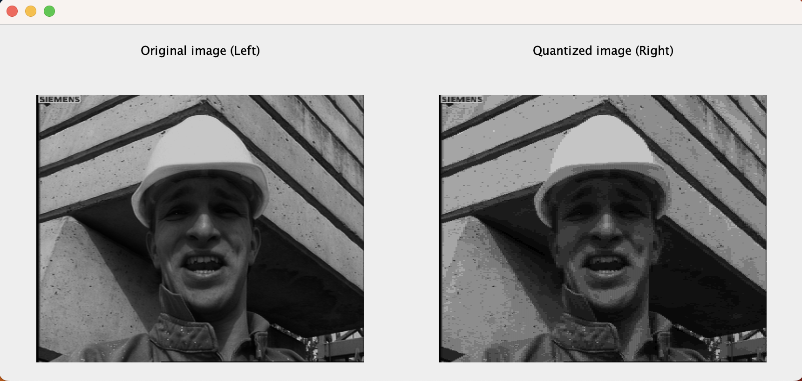
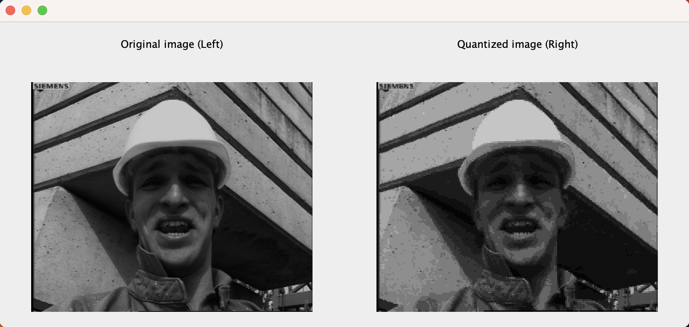
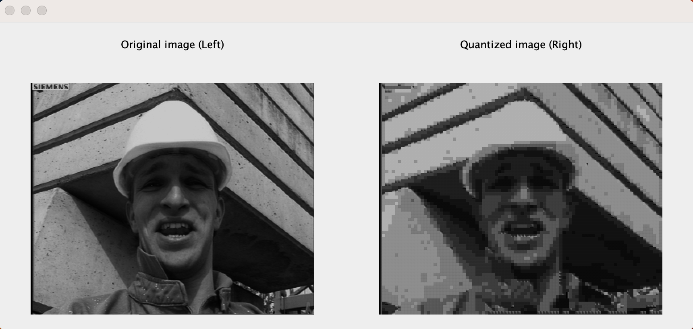

## Homework 2: Vector Quantization ##

The purpose of this homework assignment is to understand compression of images using the 
process of vector quantization.

Refer to the [homework specs.](Assignment%202%20-%20Description.pdf) for exact details of the assignment.

### Build and Run ###
- Compile the program using the command ```javac MyCompression.java```.
- Run the compiled binary using the command ```java MyCompression <image> <m> <n>```

#### The program uses the following parameters:
```
image   - Path of the binary image file to be processed. 
m       - The size of the vector (dimentionality) to be used to constructs the image vectors.
n       - The number of codebook vectors to be used. n codewords require log(n) bits for their representation.
```

### Implementation Details ###

- Step 1: Vector space is implemented as a euclidean space in Rm.
- Step 2: After the image is converted into a vector representation, all distinct vectors are collected and shuffled. The first n vectors are chosen as initial codebook vectors. 
- Step 3: Nearest cluster is assigned and the new centroid is calculated. 
- Step 4: Based on the new centroids, the codebook vectors and updated. 
- Step 5: Steps 3 and 4 are repeated until convergence (avg. difference is less than a threshold). Following this, each vector is quantized to the nearest codebook vector and the pixel values are updated in the image.

#### The Experimental Analysis can be found in [this](https://docs.google.com/document/d/1Ug_eLGV-RO-PuSUuVkr07jvNXgm4i7JCq53jDXMgosw/edit?usp=sharing) document.
#### The Archive containing the outputs of the experimentation can be accessed through [here](https://drive.google.com/drive/folders/1H_t-mGbfAKybV21AEpGd2UfQoU4a7v7r?usp=sharing).
#### Log for a sample execution can be found [here](https://drive.google.com/file/d/1ADoL4ynEBBZLdEvjBCZgBvn4dmtxC_Ad/view?usp=sharing).

### Sample Outputs ###

#### Demo run for parameters (image=1 [image file], m=2 [size of the vector], n=16 [codebook size])


#### Demo run for parameters (image=1 [image file], m=4 [size of the vector], n=16 [codebook size])


#### Demo run for parameters (image=1 [image file], m=16 [size of the vector], n=16 [codebook size])

